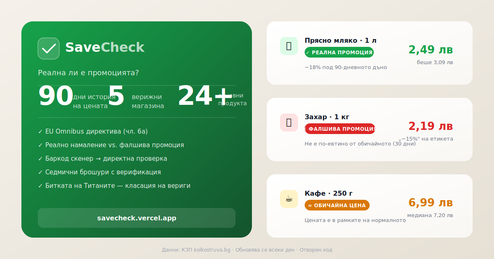

# SaveCheck — Реална ли е промоцията?



**SaveCheck** проверява дали промоцията е истинска или измамна, като сравнява текущата цена с 90-дневната история. Прилага логиката на **EU Omnibus директива (чл. 6а)** — референцата е не „старата цена" от етикета, а реалното дъно за последните 30 дни.

🔗 **Live demo:** `save-check-murex.vercel.app`

---

## Как работи

```
КЗП open data (kolkostruva.bg)
        │  ZIP с CSV по вериги, всеки ден
        ▼
gen_demo_data.py  ──►  public/data.js
gen_brochures.py  ──►  public/brochures.js
        │
        ▼  (GitHub Actions, всеки ден 08:00 EET)
Vercel auto-deploy ──► Live сайт
```

За всеки продукт се изчислява **Omnibus verdict**:

| Verdict | Значение |
|---------|----------|
| 🟢 **РЕАЛНА** | Цената е по-ниска от дъното за последните 30 дни |
| 🔴 **ФАЛШИВА** | Промоцията е налична, но цената не е по-ниска от обичайното |
| 🟡 **ОБИЧАЙНА** | Малко под медианата, но без значително намаление |
| ⚪ **НЯМА ДАННИ** | Недостатъчна история |

Присъдата се смята **поотделно за всяка верига** (`by_chain`) — цената, показана по подразбиране за продукт, е винаги от най-евтината верига в момента (не от тази с "най-честната" промоция), за да не се възнаграждава изкуствено завишена базова цена.

---

## Функционалности

- **Хедър** — лого (тап → Начало) + слоган + държава; ред с **глобална търсачка** (локално търсене, без AI).
- **🏠 Начало** — Hero с реалните спестявания (акварелен банер) + лента-кука „**N подвеждащи промоции**" (последните 30 дни) + мини класация на Титаните
- **🛒 Пазарувай** — 22 проследени продукта (базова кошница) с филтър **„Къде пазаруваш?"** по верига (Lidl / Kaufland / Billa / Fantastico — цена, присъда и графика се преизчисляват за избраната верига), филтър по присъда (Всички / 🟢 Реална / 🔴 Фалшива / 🟡 Обичайна), 90-дневна графика, кошница с анализ по верига
- **🏷️ Промоции** — Всички промо оферти тази седмица по верига (секциите са свити по подразбиране), верифицирани срещу собствената история на всеки конкретен продукт (не блендната категория) + **Битката на Титаните** (класация коя верига лъже най-много)
- **10 езика** — BG, SR, MK, RO, EL, TR, SQ, BS, HR, SL

> Скенерът за баркод и таб „Рецепти" съществуват в кодовата база, но са скрити в текущия MVP интерфейс.

---

## Data pipeline

```
kolkostruva.bg/opendata_files/YYYY-MM-DD.zip
    └── ЛидлБългария_131071587.csv
    └── Kaufland_*.csv
    └── BILLA_*.csv
    └── ФАНТАСТИКО_*.csv
    └── Т МАРКЕТ_*.csv
```

Всеки ZIP съдържа по един CSV на верига с колони:
`Населено място, Търговски обект, Наименование, Код, Категория, Цена на дребно, Цена в промоция`

Когато `Цена в промоция` е попълнена → `is_promo = True` → се проверява дали е по-евтино от `min_30_prior`.

`gen_demo_data.py` следи всеки продукт на две нива: категория (най-евтиното съвпадение на регекс на ден — захранва Продукти/Титани) и по конкретен вариант/марка в рамките на всяка верига (`by_chain`, захранва верификацията на брошурните артикули срещу собствената им история, а не блендна категория).

---

## Tech stack

| Layer | Технология |
|-------|------------|
| Frontend | Single-file HTML/CSS/JS (vanilla, no framework) |
| Charts | Chart.js 4.4 |
| Barcode | Native `BarcodeDetector` + [ZXing](https://github.com/zxing-js/library) 0.21 fallback (в кода, скрит в текущия UI) |
| Data | `window.SAVECHECK_DEMO` + `window.SAVECHECK_BROCHURES` (JS globals) |
| Backend | Python 3.11+ (`src/savecheck/`) |
| Pricing engine | `savecheck.pricing` — `evaluate_series()`, `compute_stats()` |
| Ingest | `savecheck.ingest.kolkostruva` — парсва КЗП CSV |
| CI/CD | GitHub Actions (daily cron) + Vercel (auto-deploy on push) |
| Barcode lookup | [Open Food Facts API](https://world.openfoodfacts.org/api/v2/) |

---

## Локална разработка

```bash
# 1. Clone
git clone https://github.com/Tems-git/SaveCheck.git
cd SaveCheck

# 2. Python env
python -m venv .venv && source .venv/bin/activate
pip install -e ".[ingest]"

# 3. Изтегли данни (последните 91 дни)
mkdir -p /tmp/kzp_zips
for i in $(seq 0 90); do
  D=$(date -d "$i days ago" +%Y-%m-%d)
  curl -fsSL -A "Mozilla/5.0" \
    "https://kolkostruva.bg/opendata_files/${D}.zip" \
    -o "/tmp/kzp_zips/${D}.zip" 2>/dev/null || true
done

# 4. Генерирай data files
python scripts/gen_demo_data.py --zip-dir /tmp/kzp_zips
python scripts/gen_brochures.py --zip-dir /tmp/kzp_zips

# 5. Отвори в браузър
open public/index.html
# или: python -m http.server 8000 -d public
```

### Тестове

```bash
pytest tests/ -v
```

---

## Автоматично обновяване

`.github/workflows/daily-refresh.yml` — стартира всеки ден в 08:00 EET (05:00 UTC):

1. Изтегля последните ZIP-ове от КЗП (кеширва ги за седмицата)
2. Пуска `gen_demo_data.py` → `public/data.js`
3. Пуска `gen_brochures.py` → `public/brochures.js`
4. `git commit && git push` ако има промени
5. Vercel автоматично деплойва новия commit

След промяна в `gen_demo_data.py`/`gen_brochures.py` е нужно този workflow да се пусне ръчно (Actions → Run workflow), за да се видят новите полета в живите данни — cron-ът сам по себе си не подхваща веднага код, качен между две планирани обновявания.

---

## Структура

```
SaveCheck/
├── public/
│   ├── index.html          # Цялото приложение (single-file)
│   ├── data.js             # Генерирани данни (SAVECHECK_DEMO)
│   ├── brochures.js        # Седмични промоции (SAVECHECK_BROCHURES)
│   └── og.svg               # Open Graph image
├── src/savecheck/
│   ├── pricing/
│   │   ├── verdict.py      # evaluate_series() — Omnibus логика
│   │   └── aggregates.py   # compute_stats() — 30/90-дневни статистики
│   └── ingest/
│       └── kolkostruva.py  # Парсване на КЗП CSV
├── scripts/
│   ├── gen_demo_data.py    # Генерира data.js
│   └── gen_brochures.py    # Генерира brochures.js
├── tests/
└── .github/workflows/
    └── daily-refresh.yml
```

---

## Данни и лиценз

Ценовите данни са от [КЗП „Колко струва"](https://kolkostruva.bg/opendata) — публичен регистър на цените, поддържан от Комисията за защита на потребителите на Р. България.

Кодът е с отворен лиценз — **MIT**.
