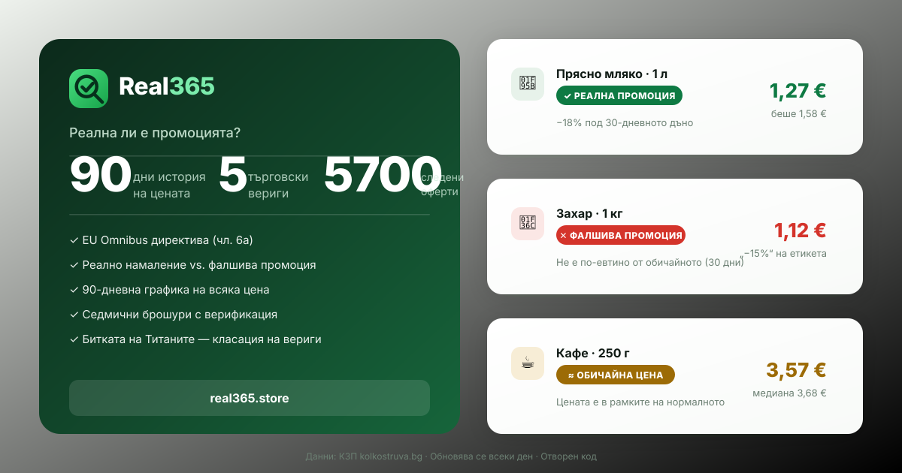

# Real365 — Реална ли е промоцията?



**Real365** проверява дали промоцията в супермаркета е истинска или маркетингова измама. Сравнява текущата цена на всеки конкретен продукт с 90-дневната му история и прилага логиката на **EU Omnibus директива (чл. 6а)** — референцията е не „старата цена" от етикета, а реалното дъно за последните 30 дни преди промоцията.

🔗 **Live demo:** [real365.store](https://real365.store) (installable като PWA, зад Cloudflare с A-grade security headers)

---

## Как работи

```
КЗП open data (kolkostruva.bg)
        │  ZIP с CSV по вериги, всеки ден
        ▼
scripts/gen_demo_data.py  ──►  docs/products.js             (product-first snapshot)
                          ──►  docs/products-history.js     (90-дневна история per оферта)
                          ──►  docs/data.js                 (22-категорийна легенда, legacy — flagged for removal)
scripts/gen_brochures.py  ──►  docs/brochures.js            (седмични промоции с fallback)
        │
        ▼  (GitHub Actions, два пъти на ден — 10:00 и 18:00 UTC)
GitHub Pages ──► Cloudflare edge (proxy) ──► Live сайт с security headers
```

**Core module:** [`src/savecheck/pricing/snapshot.py`](src/savecheck/pricing/snapshot.py) — `compute_snapshot(offering, ref)` е single source of truth. И `gen_demo_data.py` (products.js), и `gen_brochures.py` (brochures.js) използват точно същата функция за да изчислят verdict-a на всеки продукт. Това гарантира, че броят real deals в Home и броят green items в брошурата за същата верига **винаги съвпадат**.

За всяка оферта (продукт × верига) се изчислява **Omnibus state**:

| State | Значение |
|-------|----------|
| 🟢 **real** | Промо цената е под най-ниската от последните 30 дни — реална икономия |
| 🟡 **cosmetic** | Има малка отстъпка спрямо 90-дневната медиана, но не значителна |
| 🔴 **fake** | Обявена промоция, но цената НЕ е под 30-дневното дъно — маркетинг |
| ⚪ **unverified** | Обявена промоция, но има под 3 наблюдения за 30 дни — недостатъчна история |
| **regular** | Не е обявена като промо (без иконка на картите) |

Присъдата се смята **поотделно за всеки конкретен продукт в конкретна верига**, срещу собствената му 90-дневна крива — не срещу блендната категория. Така 400-грамов кашкавал „Домлян БДС" в Kaufland се сравнява със себе си от вчера, не с най-евтиния кашкавал в категорията.

---

## Функционалности

### 🏠 Начало

- **Hero карта** — реалните спестявания в кошницата ти (retail − price)
- **Fake hook** — „N подвеждащи промоции (последните 30 дни)"
- **Cart hook** — при items в кошницата се показва зелен банер с брой + общ total; клик → Кошница
- **Търсене** (глобално, пише се където и да си, скача те в Начало)
- **Филтър по верига** (chips) + бутон **× за изчистване на search-a**
- **Топ 6 реални промоции**, подредени по omnibus % desc
- **Дата на данните** (📅 DD.MM.YYYY под section label) — user винаги знае кога е генериран последният snapshot
- **⚠️ Stale data banner** — ако КЗП не публикува feed 2+ дни, показва се жълт (2 дни) или червен (3+ дни) warning с точния брой дни задкъснение. Пази trust проактивно вместо тихо да показва stale цени.
- **Бутон „Виж всички N реални промоции"** — разширява до 50 items; state се reset-ва при смяна на chain filter
- **Мини класация „Битката на титаните"** — коя верига лъже най-често

### 💬 Empty states (диференцирани)

Не един общ „няма нищо" — три разграничени контекста, всеки със свой icon + hint:

- 🔍 **Search miss** — „Няма резултати за „{q}" · Опитай друга дума или по-кратък израз"
- 🏪 **Chain filter miss** — „Няма продукти от {chain} с достатъчно данни" + reset action бутон „Виж всички вериги"
- 📭 **Data missing** — „Няма данни за днес · Опитай пак по-късно" (при празен products.js)

### Детайл модал на продукт

- Име, верига, KZP категория
- Badge за state с обяснение (i18n across 11 languages чрез `PRODUCT_MODAL_I18N.stateLabel` / `stateExplain`)
- Разграничение на процентите:
  - **„Реално −N%"** (зелен, спрямо 90-дневната медиана)
  - **„Обявено на етикета −N%"** (сив, спрямо retail) — показва се само когато двата се различават
- 90-дневна графика на цената (промо дни в червено, обичайни в тъмно сиво). Chart.js библиотеката и данните от `products-history.js` се зареждат lazy паралелно (`Promise.all`) при първо отваряне на модала — не блокират initial paint на Home.
- Stale маркер „от dd.m" ако цената е от преди днешния snapshot
- Stats labels (Най-ниска цена за 30 дни / Медиана за 90 дни), chart legend (наблюдения, промо, обичайна), chart empty state — всички i18n across 11 languages
- **Focus management** — при отваряне фокусът скача на × close бутона; при затваряне се връща на елемента, който отвори модала (продуктова карта)
- **Focus trap** — Tab циклира вътре в модала, не бяга навън

### 🛒 Кошница

Има два входа за same underlying cart (`pcart` — product-first, в localStorage):

**Cart icon** (top-right) → cart-modal:
- Per-item state icons (🟢🟡🔴⚪) — real-time от products.js
- Live price refresh при отваряне на модала
- **+/− количество** на всеки item с i18n aria-label + hover title (11 langs)
- **Общо** + **Спестяваш спрямо цените на етикета**
- **Разбивка ПО ВЕРИГИ** (само информативно) с per-chain totals + item counts (i18n plural) и честен disclaimer защо не сравняваме един и същ продукт между вериги (различни product кодове; cross-chain matching е separate roadmap item)

**Home cart hook** → Shop view Basket:
- Chain grouping (per-chain панели с per-chain total)
- Grand total при items от 2+ вериги
- **„Не забравяй"** (custom notes) — free-text reminders (сол, специалитет, каквото). Ясно е че тoва **не са** line items — не се броят в total, имат курсивен hint отдолу.

### 🏷️ Промоции (брошури)

- Всички промо оферти тази седмица, по верига (секциите свити по подразбиране)
- Верифицирани срещу собствената 90-дневна история на всеки конкретен продукт
- При липсваща верига за деня — fallback до 3 дни назад с маркер „от dd.m"
- **Clickable items** — клик или Enter/Space върху item отваря детайл модала (с 90-дневната графика и analytics)
- **Verdict-first подредба** — 🟢 real → 🟡 cosmetic → ⚪ unverified → 🔴 fake. Scannable — всички реални deals групирани заедно вместо разбъркани със fake-ове по savings
- **Битката на титаните** — класация коя верига лъже най-често (втори таб)

### 📱 PWA — installable app

- **Manifest** (`docs/manifest.webmanifest`) — standalone display, portrait, брендирани икони (192/512/180 px), theme color
- **Service worker** (`docs/sw.js`) — two-tier caching strategy:
  - **Shell (index.html, icons, manifest)** — cache-first, instant load
  - **Data (products.js, brochures.js, history)** — network-first с cache fallback за offline usage
- **Install to Home Screen** — Chrome Android + Safari iOS показват install prompt след първо посещение; app-ът отваря fullscreen без URL bar
- **Offline shell** — при загубена връзка (супермаркет с лош signal, метро) app-ът все още отваря с последния cached snapshot

### 🌍 11-language coverage (100% на visible UI)

UI-ят е локализиран за **BG, EN, SR, MK, RO, EL, TR, SQ, BS, HR, SL** — Balkan region + English като lingua franca за международна expansion. Language selector в top-right показва флаг+код на всичките 11.

**Централизирани i18n dictionaries** — всеки нов user-facing string минава през centralized dictionary с cross-reference pattern:
- `BX` / `BX_EX` — main labels (~60 keys) + a11y aria-labels (close, product details, info dialog, qty +/-, remove)
- `UI` — product modal + product chrome
- `HX` — home labels + item plurals + cart savings label
- `HEADER_I18N` — brand tagline, section labels, "See all N" toggle, footer link
- `CART_I18N` — cart button labels + modal chrome (total, savings, disclaimer, clear confirm)
- `CUSTOM_I18N` — „Не забравяй" custom notes cluster
- `EMPTY` — differentiated empty states
- `INFO_I18N` — „Как работи Real365" info modal (~1000 chars × 11 langs)
- `PRODUCT_MODAL_I18N` — verdict system (stateLabel + stateExplain nested)
- `PRODUCT_MODAL_INLINE` — stats labels, chart legend, stale text, error message
- `TAG` / `BADGE` — verdict labels
- `FILTER_ALL` / `NO_MATCH` — utility dicts

**Language persistence** — избраният език се запазва в `localStorage` (`savecheck_lang`) и се възстановява при следващо посещение. Fallback до BG default при blocked localStorage (private mode).

**Flag rendering** — bundled Twemoji Country Flags WOFF2 (78 KB, cached forever от SW) осигурява emoji flag rendering на Windows 10 (Windows fallback fonts не render-ват regional indicator symbols нативно). macOS / iOS / Android / Linux / Windows 11 continue to use native emoji fonts.

Валута default е EUR за MVP; per-country (RON, RSD, MKD, TRY, ALL, BAM) се set-ва при реален launch в дадена страна.

### 🔒 Security headers (Cloudflare proxy)

Домейнът минава през Cloudflare edge (free plan) с Transform Rules за 7 HTTP response headers:

| Header | Value | Защита |
|--------|-------|--------|
| `Strict-Transport-Security` | `max-age=15552000` (6 months) | Forced HTTPS, protection от MITM downgrade |
| `Content-Security-Policy` | `default-src 'self'; script-src 'self' 'unsafe-inline' https://cdn.jsdelivr.net; connect-src 'self' https://kolkostruva.bg https://cdn.jsdelivr.net; frame-ancestors 'none'; ...` | XSS defense-in-depth, resource origin restriction |
| `X-Content-Type-Options` | `nosniff` | Prevent MIME sniffing |
| `X-Frame-Options` | `DENY` | Prevent clickjacking (iframe embedding) |
| `Referrer-Policy` | `strict-origin-when-cross-origin` | User privacy на outbound links |
| `Permissions-Policy` | `camera=(), microphone=(), geolocation=(), payment=(), usb=(), interest-cohort=()` | Deny unused browser APIs + opt-out от Google FLoC |

**Grade A** на securityheaders.com (capped при A because CSP includes `'unsafe-inline'` — Real365 ползва много inline event handlers; refactor до strict CSP + nonce би било 5-10 часа работа за theoretical XSS benefit).

### Общи UX

- **Escape** затваря модала
- **„Първите 30 от N"** в search резултатите — ясно е, че виждаш само част
- **Auto-refresh** на Home hero и кошница когато добавяш/маха продукти
- **HTML escape** на всички КЗП имена преди render (защита от stored XSS)
- **2-line clamp** на продуктовите имена в Home и Кошница — производителят/суффиксът остава видим при подобни продукти
- Продуктовите имена остават оригинални (КЗП feed-a е bilingual само за категории)

### ♿ Достъпност (a11y)

- **ARIA семантика** — модалите имат `role="dialog"`, `aria-modal="true"`, `aria-label` синхронизиран с текущия език
- **Screen reader labels** — × close бутоните имат class-based `aria-label` (`closeLabel` key в BX за всичките 11 lang); search input, cart button, cart qty +/-, cart item remove — всички aria-labels + hover title attributes се обновяват в `renderChrome()` при смяна на език
- **Клавиатурна навигация** — product cards на Home и brochure items са `tabindex="0"` с `role="button"` + `onkeydown` handler за Enter/Space, така че цялата app-a е доступна без mouse
- **Focus indicator** — `:focus-visible` показва ясен зелен outline (2px, outline-offset 2px) само при клавиатурна навигация, не при mouse click — не разсейва mouse users
- **Focus trap** — при отворен модал Tab циклира в него, не бяга навън; при затваряне фокусът се връща на trigger element-a. Selector-ът е class-based (`.modal-close`), не aria-label-based — decoupled от i18n switching.
- **Touch targets** — modal close бутоните са 40×40 px, cart qty +/- са 32×32 px (W3C препоръчва ≥44×44, компромис за визуална компактност)
- **Stale data banner** — `role="status"` + `aria-live="polite"`, screen reader обявява warning при появяване

---

## Data pipeline

```
kolkostruva.bg/opendata_files/YYYY-MM-DD.zip
    └── ЛидлБългария_*.csv
    └── Kaufland_*.csv
    └── BILLA_*.csv
    └── ФАНТАСТИКО_*.csv
    └── Т МАРКЕТ_*.csv
```

Всеки ZIP съдържа по един CSV на верига с колони:
`Населено място, Търговски обект, Наименование, Код, Категория, Цена на дребно, Цена в промоция`

Когато `Цена в промоция` е попълнена → `is_promo = True` → се проверява дали е по-евтино от `min_30_prior`.

`gen_demo_data.py` работи в **product-first** модел: индексира **всеки** продукт в КЗП feed-а като `(product_key, chain)` двойка. `product_key` използва `product_code` когато е наличен, иначе нормализирано име (lowercase + collapsed whitespace + trailing punct стрипнат). За текущия dataset това дава около **5700 уникални оферти** от 5 вериги.

Filter: минимум 3 наблюдения в последните 30 дни (drop-ва еднократни flyer items които не са част от асортимента).

**Outlier filter (per-store observations).** КЗП CSV съдържа по един ред на (продукт × магазин × ден). Верига като Kaufland има ~300 магазина — повечето продават Tchibo кафе на 15€, но 5 могат да имат еднодневен clearance на 2€. Ако вземем просто `min()` от всички наблюдения, 2€ „печели" и продуктът се появява като 74% off deal за цялата верига — подвеждащо.

За всяка (product_key, day) двойка:

1. Събираме всички наблюдения от магазините на веригата
2. Ако имаме ≥ `OUTLIER_MIN_OBS` (5) магазина И `min < OUTLIER_MEDIAN_RATIO × median` (`0.4 × median` = 60%+ off vs peers) → флагваме outlier
3. За outlier случаи взимаме observation-a **най-близко до median-a** вместо min-a — по-honest представяне на реалната цена за веригата
4. Иначе fallback до старото поведение (cheapest observation wins)

Threshold-ите са в `gen_demo_data.py` на module top level за лесно tune-ване. Cron log-a printва `outliers_filtered=N` за всеки ZIP, за да се вижда impact-а.

Три output-a се генерират в един pass:

- **`products.js`** — compact current-snapshot: name, chain, price, retail, is_promo, state, omnibus_pct, KZP category, BASKET category tags (0..N). ~1.8 MB.
- **`products-history.js`** — full 90-day price history per оферта, в компактен `[day_offset, price, is_promo]` формат. Loaded lazy при първо отваряне на детайл-модал. ~6 MB uncompressed / 0.87 MB gzip.
- **`data.js`** — legacy 22-категорийна витрина, реконструирана от product-first index-a. Захранва Битката на титаните и остатъчна легенда. **Планирано за removal** — Titans ще мигрира към products.js meta, което ще позволи drop-ване на 880 KB payload + един по-малко файл в cron pipeline-a.

`gen_brochures.py` използва същия `load_all_products` + `compute_snapshot` pipeline, филтрира по `is_promo=True` at REF, сортира по: **(1)** verdict — 🟢 green → 🟡 yellow → ⚪ gray → 🔴 red, **(2)** basket items първи в рамките на всеки verdict, **(3)** omnibus_pct desc — най-голяма реална отстъпка първа, cap 500 per chain. Verdict-first подредбата прави брошурата scannable (всички реални deals заедно, после cosmetic, gray, накрая fake) вместо разбъркана.

---

## Payload optimization

Initial page load (post-optimization):

| Layer | Size | Note |
|-------|------|------|
| `index.html` | ~208 KB | Single-file, all UI + logic (11 lang × 12 i18n dicts inline) |
| `products.js` | ~1.8 MB | Product-first snapshot, eager |
| `data.js` | ~880 KB | Legacy, still eager (to be dropped) |
| `hero-banner.webp` | ~400 KB | Was 2.9 MB PNG, converted (-86%) |
| `logo-d.webp` | ~64 KB | Was 1.4 MB PNG, converted (-95%) |
| `TwemojiCountryFlags.woff2` | 78 KB | Flag rendering, cached forever by SW, unicode-range scoped |
| `brochures.js` | 0 KB | **Lazy** — loads on first Home chain expand или Promos view |
| `products-history.js` | 0 KB | **Lazy** — loads with Chart.js on first product modal open |

Combined win from WebP conversion + brochures lazy load: **~4 MB less** on first-visit initial paint. На 4G mobile около 3-5 сек по-бърз app-open — важно за usage-a в супермаркети с лош signal.

---

## Валута

Приложението работи **native в EUR**. КЗП feed-а вече публикува цените в EUR (след адопцията на еврото от 01.01.2026), затова UI-ят не прави никаква конверсия.

За language dropdown-а — за MVP всичките 11 country записа default-ват на EUR. Real per-country валути (RON, RSD, MKD, TRY, ALL, BAM) се set-ват в COUNTRIES config-a при реален launch в дадена страна.

---

## Tech stack

| Layer | Технология |
|-------|------------|
| Frontend | Single-file HTML/CSS/JS (vanilla, no framework), ~208 KB |
| Charts | Chart.js 4.4 (jsDelivr CDN, lazy loaded on first modal open) |
| Data | `window.SAVECHECK_PRODUCTS` (snapshot) + `window.SAVECHECK_HISTORY` (lazy) + `window.SAVECHECK_BROCHURES` (lazy) + `window.SAVECHECK_DEMO` (legacy, to be removed) |
| PWA | Web App Manifest + Service Worker (two-tier caching: cache-first shell, network-first data) |
| Images | WebP (hero-banner, logo) — modern browser fallback, ~90% smaller than PNG source |
| Fonts | Golos Text — self-hosted variable woff2, cyrillic + latin subsets (CSP `default-src 'self'` blocks Google Fonts) · Twemoji Country Flags WOFF2 (78 KB, unicode-range scoped) for flag rendering on Windows 10 |
| i18n | 11 languages, 12 centralized dicts, localStorage persistence, 100% visible UI coverage |
| Security | Cloudflare proxy пред GitHub Pages, 7 Transform Rules за HSTS + CSP + 5 други headers, A grade на securityheaders.com |
| Backend | Python 3.11+ (`src/savecheck/`) |
| Pricing engine | `savecheck.pricing` — `evaluate_series()`, `compute_stats()`, `compute_snapshot()` |
| Ingest | `savecheck.ingest.kolkostruva` — парсва КЗП CSV |
| CI/CD | GitHub Actions (daily cron × 2, 10:00 + 18:00 UTC) + GitHub Pages (auto-deploy on push към main) → Cloudflare edge |

---

## Локална разработка

```bash
# 1. Clone
git clone https://github.com/Tems-git/SaveCheck.git
cd SaveCheck

# 2. Python env
python -m venv .venv && source .venv/bin/activate
pip install -e ".[ingest]"

# 3. Изтегли данни (последните 91 дни)
mkdir -p /tmp/kzp_zips
for i in $(seq 0 90); do
  D=$(date -d "$i days ago" +%Y-%m-%d)
  curl -fsSL -A "Mozilla/5.0" \
    "https://kolkostruva.bg/opendata_files/${D}.zip" \
    -o "/tmp/kzp_zips/${D}.zip" 2>/dev/null || true
done

# 4. Генерирай data files
python scripts/gen_demo_data.py --zip-dir /tmp/kzp_zips
python scripts/gen_brochures.py --zip-dir /tmp/kzp_zips

# 5. Отвори в браузър
open docs/index.html
# или: python -m http.server 8000 -d docs
```

**Note за service worker при dev:** SW cache-ва старата HTML при промени. За instant refresh на локални промени в DevTools → Application → Service Workers → check "Update on reload". Или bump-ни `CACHE_VERSION` в `docs/sw.js` за форсирано refresh на всички installed clients.

### Тестове

```bash
pytest tests/ -v
```

57 unit тестове (aggregates, verdict, snapshot, history, alerts, ingest parser).

---

## Автоматично обновяване

`.github/workflows/daily-refresh.yml` — стартира **два пъти на ден**:

- **10:00 UTC (13:00 EET)** — early attempt, покрива случаи когато КЗП качва навреме
- **18:00 UTC (21:00 EET)** — safety net за случаи когато КЗП качва по-късно през деня

Всеки run:

1. Изтегля последните ZIP-ове от КЗП (кеширва ги за седмицата)
2. Пуска `gen_demo_data.py` → `docs/data.js`, `docs/products.js`, `docs/products-history.js`
3. Пуска `gen_brochures.py` → `docs/brochures.js`
4. `git commit && git push` **само ако** има реални промени (иначе no-op — вторият run е тих ако първият вече е взел днешния feed)
5. GitHub Pages автоматично деплойва новия commit → Cloudflare edge → `https://real365.store`

**Commit message stamps data date, not runner date.** КЗП понякога публикува feed-а с 1+ ден закъснение, така че commit-a от 21 юли може да съдържа data-та за 19 юли. Ако commit message-a казваше runner date-a, това би маскирало реалното забавяне. Сега sed-извлича `generated_for` от `products.js` и го използва — commit history и Home stale banner винаги казват едно и също.

След промяна в `gen_demo_data.py` / `gen_brochures.py` / `snapshot.py` е нужно този workflow да се пусне ръчно (Actions → Run workflow), за да се видят новите полета в живите данни — cron-ът не подхваща веднага код, качен между две планирани обновявания.

---

## Структура

```
SaveCheck/
├── docs/
│   ├── index.html                # Цялото приложение (single-file, ~208 KB)
│   ├── sw.js                     # Service Worker (two-tier caching)
│   ├── manifest.webmanifest      # PWA manifest (install-to-home-screen)
│   ├── data.js                   # Legacy 22-cat снимка (SAVECHECK_DEMO) — to be dropped
│   ├── products.js               # Product-first snapshot (SAVECHECK_PRODUCTS)
│   ├── products-history.js       # 90-day history, lazy loaded (SAVECHECK_HISTORY)
│   ├── brochures.js              # Седмични промоции, lazy loaded (SAVECHECK_BROCHURES)
│   ├── og.svg                    # Open Graph image
│   └── img/
│       ├── hero-banner.webp      # Home hero image (WebP, 400 KB)
│       ├── icon-*.png            # PWA icons (192/512/180)
│       ├── TwemojiCountryFlags.woff2  # Flag rendering font (78 KB, Windows 10 compat)
│       └── logos/logo-d.webp     # Brand logo (WebP, 64 KB)
├── src/savecheck/
│   ├── pricing/
│   │   ├── snapshot.py           # compute_snapshot() — SINGLE SOURCE OF TRUTH
│   │   ├── verdict.py            # evaluate_series() — Omnibus логика
│   │   ├── aggregates.py         # compute_stats() — 30/90-дневни статистики
│   │   ├── history.py            # build_chart() — chart series builder
│   │   └── alerts.py             # evaluate_watch() — price watch alerts (not wired in UI yet)
│   ├── ingest/
│   │   └── kolkostruva.py        # Парсване на КЗП CSV
│   └── shopping/                 # Shopping list logic (for future fridge feature)
├── scripts/
│   ├── gen_demo_data.py          # Генерира data.js + products.js + products-history.js
│   ├── gen_brochures.py          # Генерира brochures.js (използва shared snapshot)
│   ├── analyze_cross_chain.py    # Read-only: съпоставимост на продукти между вериги
│   ├── analyze_duplicates.py     # Read-only: дублирани оферти в рамките на верига
│   └── analyze_category_basket.py # Read-only: годност на 22-те категории за кошница
├── tests/
│   ├── test_snapshot.py          # 15 теста за shared snapshot
│   ├── test_verdict.py
│   ├── test_aggregates.py
│   ├── test_history.py
│   ├── test_alerts.py
│   ├── test_shopping_list.py
│   └── test_ingest_parser.py
└── .github/workflows/
    └── daily-refresh.yml         # Two cron runs (10:00 + 18:00 UTC)
```

**External infrastructure:** Cloudflare account (free plan) proxying real365.store — 5 Transform Rules за security headers + native HSTS in SSL/TLS settings. Configuration lives в Cloudflare dashboard, not git.

---

## Известни ограничения

Проактивно flagged, не bugs:

- **`data.js` все още се качва еагерно** (~880 KB). Titans view го консумира. Планираното му премахване обаче е под въпрос: категорийната кошница (по-долу) стъпва точно върху неговите 22-категорийни серии, а `products.js` не ги носи в тази форма. Решението за drop чака решението за кошницата.
- **Cross-chain matching — измерено и отпаднало (05.08.2026).** `scripts/analyze_cross_chain.py` върху 4310 оферти: 100% от продуктите имат `code`-базиран ключ, но **нула** съвпадения между вериги — кодовете са изцяло вътрешнофирмени, няма обща EAN основа. Съпоставяне по нормализирано име + разфасовка дава **15 групи**; хлабавото по множество от думи — 49. Всичките са маркова пакетирана стока (SYOSS, MILKA, SENSODYNE, Devin) — нищо прясно, нищо собствена марка, защото `ПЛЕШКА СВИНСКА ПР-Д АЛДАГОТ` наистина е друг продукт, а не същият под друго име. Качеството на намереното е добро (медианен разсейв 1.31x, нито една група над 2x), тоест ограничението не е в алгоритъма — няма какво да се хване, а по-хлабава нормализация само би започнала да произвежда фалшиви двойки. **Класацията на вериги по цена на кошницата от дизайна не е постижима по този път.** Не си струва преразглеждане без нов източник на данни.
- **Категорийна кошница — възможна, но иска нормализация.** Пътят към „къде е най-евтино" минава през 22-те BASKET категории, не през конкретни продукти: сравняваме „най-евтиното прясно мляко 1л", както правят реалните ценови индекси. `scripts/analyze_category_basket.py` показва, че в сегашния вид би подвеждало. Само **6 от 22** категории имат цена във всичките пет вериги. И по-съществено — сравняват се несравними неща: масло 125 г срещу 250 г, сирене 200 г срещу 400 г, пилешко **бутче** срещу пилешко **филе**, Evian срещу Горна баня. `UNIT_INFO` приема фиксиран грамаж за категория, вместо да чете реалния от името на продукта. Преди какъвто и да е интерфейс: четене на разфасовката от името, сравнение на килограм и литър, стесняване на изразите, решение какво правим с непълните категории. Оценка 3-5 часа, предимно Python.
- **Делът на реалните промоции варира петдесеткратно между веригите — необяснено.** Kaufland 45/223 (20.2%), Fantastico 304/2359 (12.9%), T Market 84/762 (11.0%), Lidl 13/698 (1.9%), Billa 1/280 (0.4%). Lidl живее от промоции; 1.9% не описва нищо, което може да се види в магазин. Най-правдоподобното обяснение е, че веригите различно попълват колоната „Цена в промоция" към КЗП — ако някои свалят направо цената на дребно, техните промоции не съществуват за pipeline-а, защото `is_promo` никога не става истина. Ако е така, **Битката на Титаните класира счетоводна дисциплина, а не честност**, а това е публично твърдение в приложението. Непроверено — виж дела на `is_promo` по вериги.
- **Products / Recipes / Fridge sub-tabs** — hidden в UI (sub-tab bar не се render-ва в Shop view). Кодът е intact за future revive, но не се достига от навигация.
- **Legacy dead code** — `renderProducts`, `renderRecipes`, `renderFridge`, `analyzeStores`, `cart`/`cartIds`/`cartSize`, `PRODUCTS` глобал са dormant. Ще се почистват в отделен pass.
- **CSP `unsafe-inline`** — Real365 има ~200+ inline event handlers (`onclick=`, `onkeydown=`) и inline styles. Strict CSP без `'unsafe-inline'` би изисквало refactor на всичко към `addEventListener` + CSS classes или nonce-based CSP. Effort: 5-10 часа. Каппва security grade на A вместо A+. HTML escape на всички КЗП имена вече минимизира real XSS surface.

---

## Данни и лиценз

Ценовите данни са от [КЗП „Колко струва"](https://kolkostruva.bg/opendata) — публичен регистър на цените, поддържан от Комисията за защита на потребителите на Р. България.

Кодът е с отворен лиценз — **MIT**.
